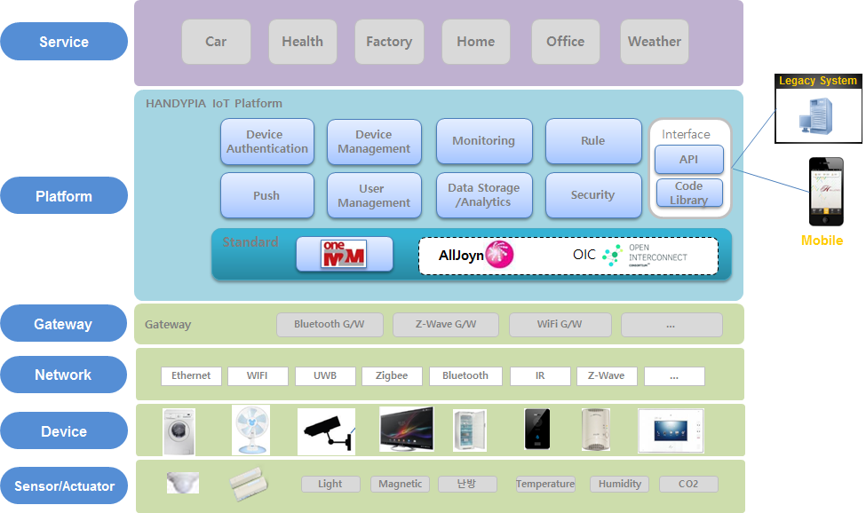

# HANDYPIA IoT Platform 2.0 
### Overview
HANDYPIA is an IoT Platform that is based on the [oneM2M](http://www.onem2m.org/)  standard. You need to understand  the following standard documents to use our platform easily

  - [oneM2M release1 specification, TS-0001-Functional Architecture(1.6.1)](http://www.onem2m.org/images/files/deliverables/TS-0001-Functional_Architecture-V1_6_1.pdf)
  - [oneM2M release1 specification, TS-0004-Service Layer Core Protocol Specification(1.6.0)](http://www.onem2m.org/images/files/deliverables/UpdateRelease1/TS-0004-Service_Layer_Core_Protocol-V1_6_0.zip)
  - [oneM2M release1 specification, TS-0009-HTTP Protocol Binding(1.5.0)](http://www.onem2m.org/images/files/deliverables/TS-0009-HTTP_Protocol_Binding-V1_5_1.pdf)

You can also refer to following related articles:
  - [oneM2M standard overview](slide/oneM2M(overview).pdf)
  - [oneM2M standard TS-0001 slides](slide/oneM2M(TS0001).pdf)
  - [oneM2M standard TS-0004 slides](slide/oneM2M(TS0004).pdf) 

### Platform Features

 Our platform technology makes it possible not only the integrated management in a single system via the web on any device connected to the Internet in the Internet of Things circumstances, but also  easy development of intelligent IoT convergence services through context-aware thing search / recommendation, connection and control. 
Specifically, oneM2M standard base our IoT platform provides the thing oriented information collection / analysis / control and has the following features. By supporting the interoperability of oneM2M standards and the flexible linkage with other devices, our platform can be utilized in the smart object product development and take advantage of this a new service application development.

  - Compatible with oneM2M standards (oneM2M Release 1).
  - Interworking with HTTP, CoAP and MQTT message protocols.
  - Multiple data repository (HBase, MongoDB, SQLite)
  - Support various proxy modules for interworking with other commercial devices
  - possible to mount various types of IoT devices (servers, gateways, etc.) SW

### APIs
Basically, out platform follows the mca interface of oneM2M standard. the mca interfaces is defened message protocole between platform and application. The following API specification include how to create and handle the major resource types such as AE(Application Entity), Container, ContentInstance, Subscription, Node, Group, etc.

* [HANDYPIA IoT Platform API](http://dev.handypia.co.kr/onem2m/doc/HANDYPIA-2.0_oneM2M_API_v0.11.html)
